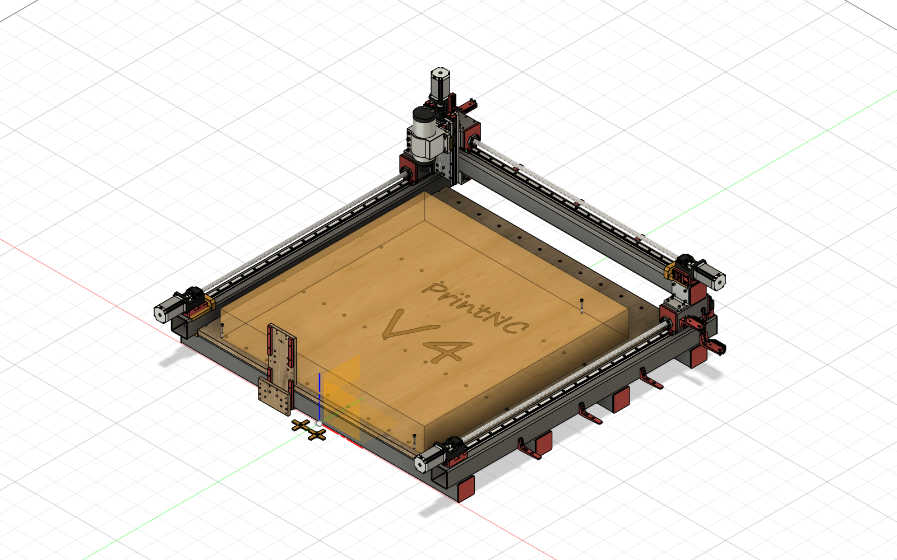

# #4 — Sekcje montażowe PrintNC V4 (≈10 sekcji)

Podział wszystkich pozycji BOM na sekcje — do instrukcji składania oraz jako układ
rozłożonego modelu 3D (styl plakatu). Kolejność = sugerowana kolejność montażu.

> **Rozłożony model 3D (plakat „Golf II”):** ten dokument to gotowy podział na sekcje.
> Samo rozłożenie/eksplozja części obok siebie wymaga ręcznej pracy w CAD (Fusion/Rhino) —
> nie da się tego w pełni zautomatyzować. Każdą sekcję poniżej rozkłada się jako osobny
> moduł, a render `model_iso.png` służy jako pogląd całości.

## 1. Rama stalowa  
_8 pozycji, ~14 szt._

| ID | Nazwa | Ilość | Wymiary (mm) |
|---:|---|---:|---|
| 26 | Profil stalowy: rama oś X | 4 | 1360 x 80 x 80 |
| 27 | Profil stalowy: rama oś Y | 2 | 1325 x 80 x 80 |
| 28 | Profil stalowy: wózek oś Y | 2 | 150 x 80 x 80 |
| 29 | Profil stalowy: usztywnienie wózka Y | 2 | 80 x 75 x 50 |
| 30 | Profil stalowy: belka bramowa X | 1 | 1360 x 80 x 80 |
| 31 | Profil stalowy: wózek oś X | 1 | 150 x 80 x 80 |
| 32 | Profil aluminiowy: kątownik wózka X | 1 | 150 x 100 x 50 |
| 35 | Podkładka dystansowa wózka X | 1 | 125 x 80 x 8 |

## 2. Wasteboard (blat)  
_1 pozycji, ~1 szt._

| ID | Nazwa | Ilość | Wymiary (mm) |
|---:|---|---:|---|
| 33 | Płyta drewniana | 1 | 1225 x 1200 x 20 |

## 3. Prowadnice liniowe i śruby kulowe  
_6 pozycji, ~10 szt._

| ID | Nazwa | Ilość | Wymiary (mm) |
|---:|---|---:|---|
| 15 | Szyna HGR20 (oś X i Y) + Wózek liniowy HGW20CC | 4 |  |
| 18 | Szyna HGR15 (oś 2Z) + Wózek liniowy HGH15CA | 2 |  |
| 21 | Śruba kulowa 1610 (oś Y) | 1 |  |
| 22 | Śruba kulowa 1610 (oś X) | 1 |  |
| 23 | Śruba kulowa 1610 (oś Y2) | 1 |  |
| 24 | Śruba kulowa 1204 (oś Z) | 1 |  |

## 4. Oś X – napęd  
_8 pozycji, ~21 szt._

| ID | Nazwa | Ilość | Wymiary (mm) |
|---:|---|---:|---|
| 43 | Mocowanie silnika HM12-57 (X) | 4 | 89 x 60 x 60 |
| 44 | Nakrętka kulowa SFU1610 (X) | 1 | 44 x 40 x 39.85 |
| 45 | Podpora BF12 (X) | 1 | 60 x 43 x 20 |
| 46 | Sprzęgło D30L40 8-10mm (X) | 5 | 26.5 x 25.98 x 25 |
| 47 | Silnik krokowy NEMA23 (X) | 5 | 25.9 x 6.67 x 0 |
| 48 | Smarowniczka płaska M6 | 1 | 10.39 x 9 x 9 |
| 49 | Smarowniczka płaska M6 (mirror) | 1 | 10.39 x 9 x 9 |
| 50 | Czujnik indukcyjny M8 (X) | 3 | 15.01 x 13 x 4 |

## 5. Oś Y – napęd  
_7 pozycji, ~21 szt._

| ID | Nazwa | Ilość | Wymiary (mm) |
|---:|---|---:|---|
| 36 | Smarowniczka płaska M6 (2) | 2 | 10.39 x 9 x 9 |
| 37 | Mocowanie silnika HM12-57 (Y) | 4 | 89 x 60 x 60 |
| 38 | Sprzęgło D30L40 8-10mm (Y) | 5 | 26.5 x 25.98 x 25 |
| 39 | Podpora BF12 (Y) | 1 | 60 x 43 x 20 |
| 40 | Nakrętka kulowa SFU1610 (Y) | 1 | 44 x 40 x 39.85 |
| 41 | Silnik krokowy NEMA23 (Y) | 5 | 25.9 x 6.67 x 0 |
| 42 | Czujnik indukcyjny M8 (Y) | 3 | 15.01 x 13 x 4 |

## 6. Oś Y2 – napęd  
_7 pozycji, ~21 szt._

| ID | Nazwa | Ilość | Wymiary (mm) |
|---:|---|---:|---|
| 51 | Smarowniczka płaska M6 (2)(mirror) | 2 | 10.39 x 9 x 9 |
| 52 | Silnik krokowy NEMA23 (Y2) | 5 | 25.9 x 6.67 x 0 |
| 53 | Mocowanie silnika HM12-57 (Y2) | 4 | 89 x 60 x 60 |
| 54 | Podpora BF12 (Y2) | 1 | 60 x 43 x 20 |
| 55 | Nakrętka kulowa SFU1610 (Y2) | 1 | 44 x 40 x 39.85 |
| 56 | Sprzęgło D30L40 8-10mm (Y2) | 5 | 26.5 x 25.98 x 25 |
| 57 | Czujnik indukcyjny M8 (Y2) | 3 | 15.01 x 13 x 4 |

## 7. Oś Z – napęd  
_4 pozycji, ~16 szt._

| ID | Nazwa | Ilość | Wymiary (mm) |
|---:|---|---:|---|
| 58 | Sprzęgło D25L30 8-8mm (Z) | 5 | 21.65 x 20.28 x 18.71 |
| 59 | Mocowanie silnika HM10-57 (Z) | 3 | 89 x 60 x 58.5 |
| 60 | Silnik krokowy NEMA23 (Z) | 5 | 25.9 x 6.67 x 0 |
| 61 | Czujnik indukcyjny M8 (Z) | 3 | 15.01 x 13 x 4 |

## 8. Zespół 2Z (karetka wrzeciona)  
_9 pozycji, ~23 szt._

| ID | Nazwa | Ilość | Wymiary (mm) |
|---:|---|---:|---|
| 62 | 2Z płyta Z 300mm Aluminium | 1 | 300 x 125 x 12 |
| 63 | Podkładka M6 | 4 | 2.8 x 1.5 x 0 |
| 64 | 2Z belka trammingu płyty  Aluminium | 1 | 100 x 25 x 12 |
| 65 | 2Z wózek HGH15CA | 8 | 32.4 x 19.53 x 2.7 |
| 66 | 2Z kostki trammingu uchwytu wrzeciona | 2 | 29.1 x 12 x 11 |
| 67 | 2Z płyta trammingu  Aluminium | 1 | 145 x 125 x 12 |
| 68 | 2Z nakrętka kulowa SFU1204 | 1 | 35.87 x 35 x 30 |
| 69 | 2Z blok nakrętki śruby kulowej | 1 | 50 x 36 x 30 |
| 73 | 2Z drukowany wspornik szyny 4x | 4 | 120 x 15 x 9 |

## 9. Wrzeciono i uchwyt  
_2 pozycji, ~2 szt._

| ID | Nazwa | Ilość | Wymiary (mm) |
|---:|---|---:|---|
| 25 | Uchwyt wrzeciona 80mm | 1 |  |
| 70 | Wrzeciono 2.2kW 80mm | 1 | 259.73 x 79.9 x 54.8 |

## 10. Złączność i drobnica  
_14 pozycji, ~513 szt._

| ID | Nazwa | Ilość | Wymiary (mm) |
|---:|---|---:|---|
| 1 | Śruba M4x8 łeb walcowy | 4 |  |
| 2 | Śruba M4x12 | 22 |  |
| 3 | Śruba M4x16 | 28 |  |
| 4 | Śruba M5x12 | 4 |  |
| 5 | Śruba M5x20 | 112 |  |
| 6 | Śruba M6x12 | 142 |  |
| 7 | Śruba M6x20 | 66 |  |
| 8 | Śruba M6x30 | 32 |  |
| 9 | Śruba M6x50 | 24 |  |
| 10 | Wkręt dociskowy M8x8 | 4 |  |
| 11 | Śruba M8x45 | 3 |  |
| 12 | Pręt gwintowany M5 (oś X) | 6 | 1275mm |
| 13 | Pręt gwintowany M5 (oś Y) | 12 |  |
| 14 | Nakrętka M5 | 54 |  |
