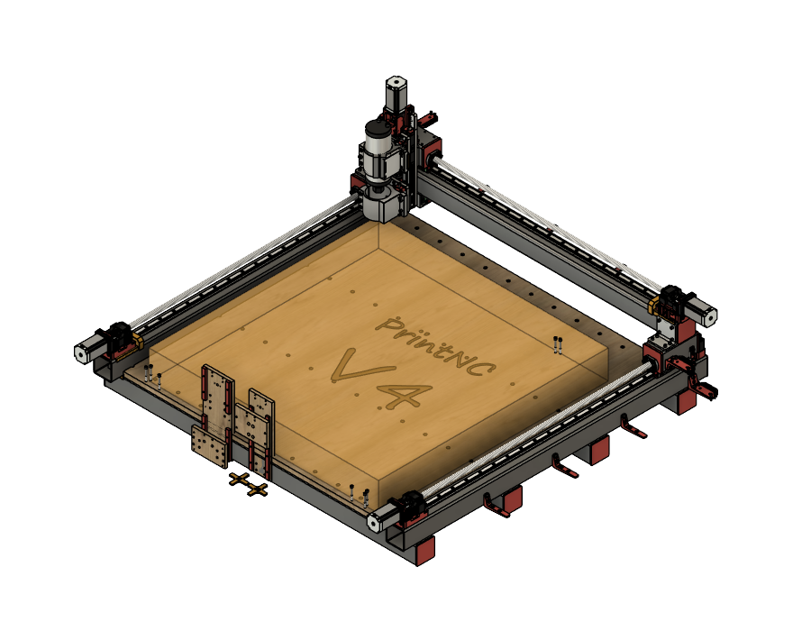
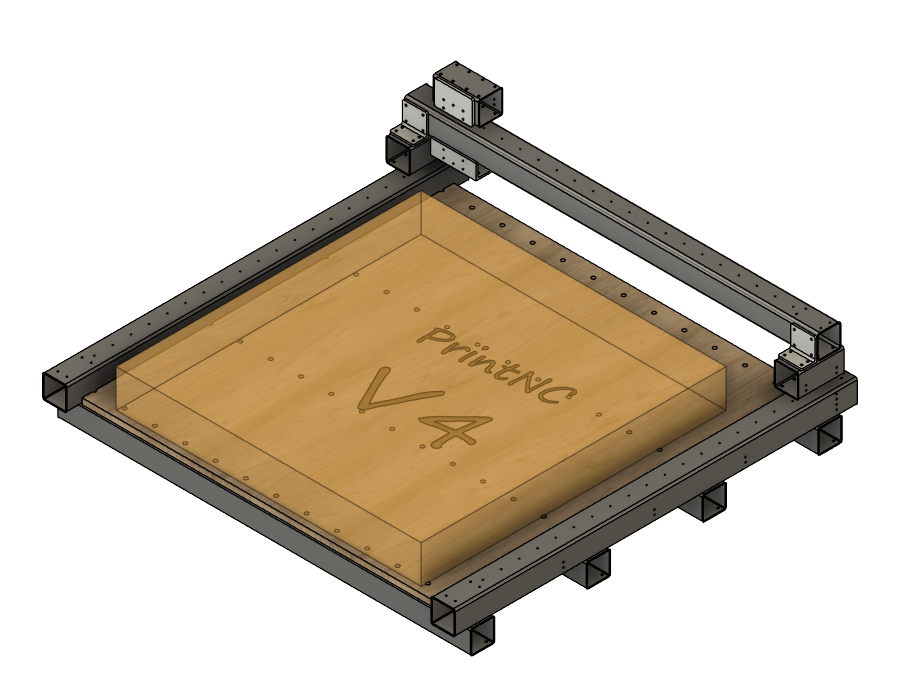
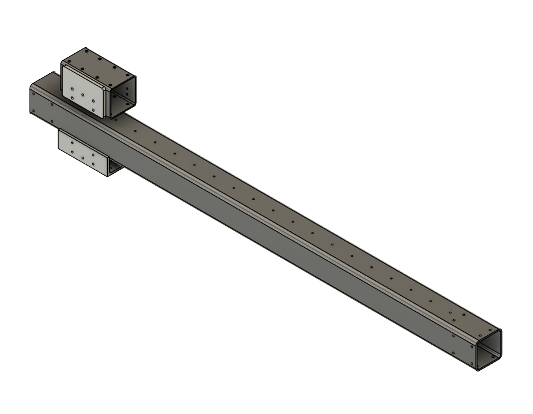
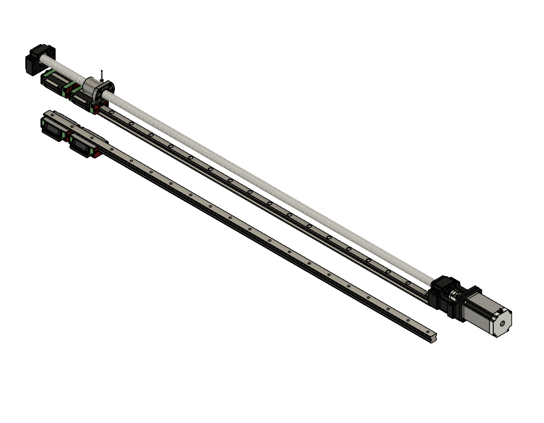
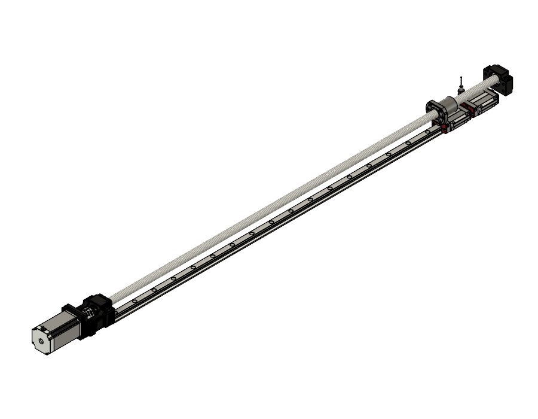
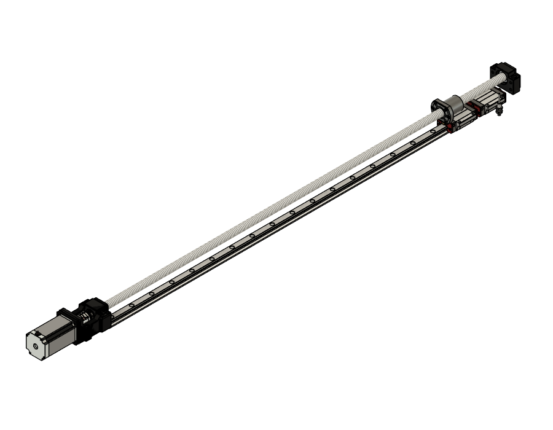
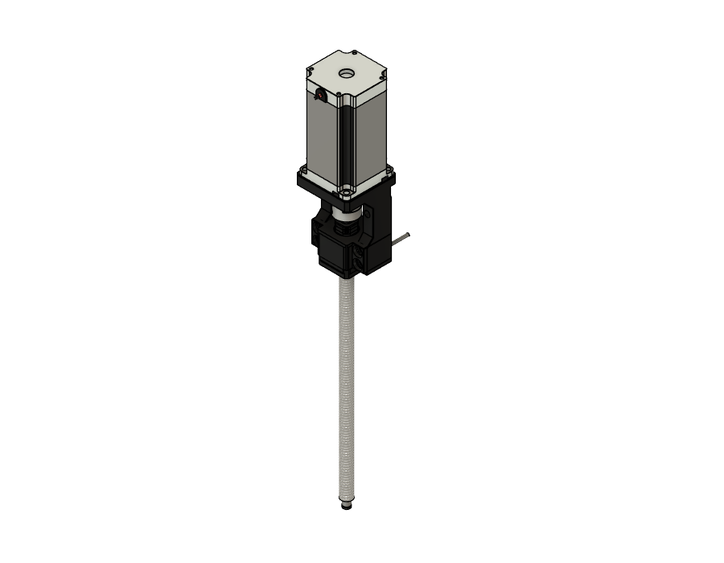
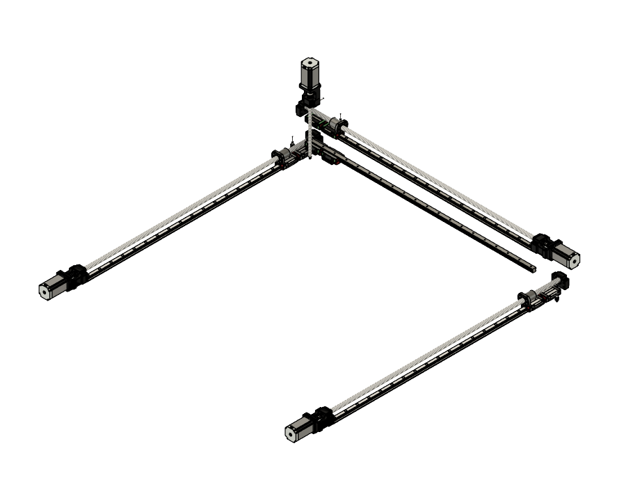
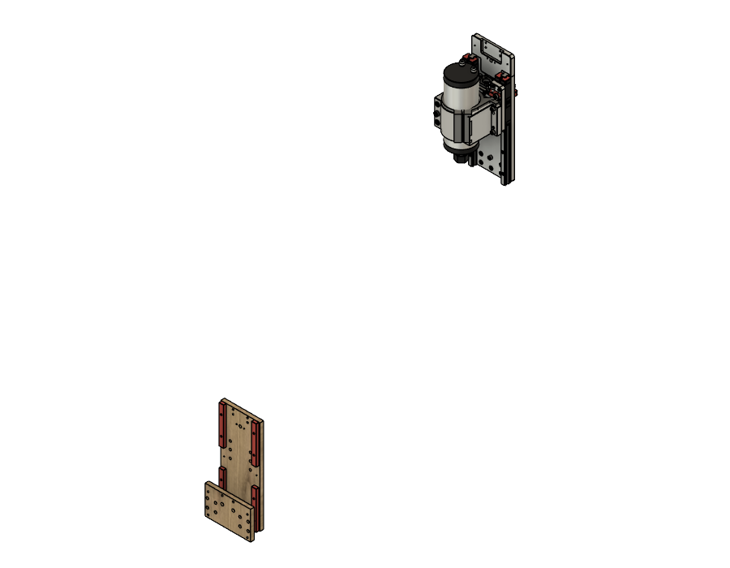
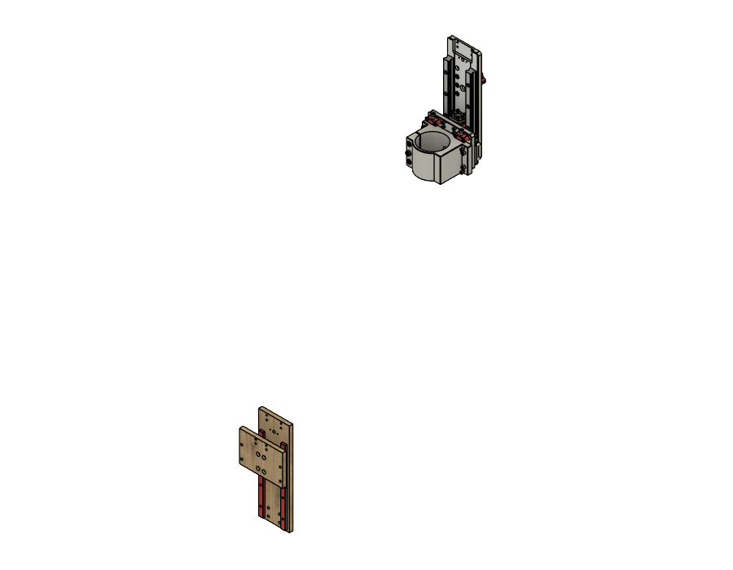

# Sekcje montażowe — rendery (#4)

Wyizolowane, transparentne widoki kolejnych sekcji modelu PrintNC V4 MetalCutter
(wyrenderowane z żywego modelu w Fusion, bez siatki/tła). Pełny podział pozycji
na sekcje: [`../04_sekcje_montazowe.md`](../04_sekcje_montazowe.md).

## 0. Cały model

## 1. Rama stalowa (Structure)

## 2. Brama / belka X (Gantry)

## 3. Oś X — napęd

## 4. Oś Y — napęd

## 5. Oś Y2 — napęd

## 6. Oś Z — napęd

## 7. Hardware — całość (X + Y + Y2 + Z)

## 8. Karetka 2Z (HGH15CA)

## 9. Karetka Z — wariant pojedynczy (HGW20CC)

---

_Uwaga: to wyizolowane widoki sekcji (do instrukcji składania i zakupów). Pełny
„rozłożony plakat" z częściami rozsuniętymi obok siebie wymaga ręcznego rozłożenia
w CAD — te rendery są gotową bazą per-sekcja._
